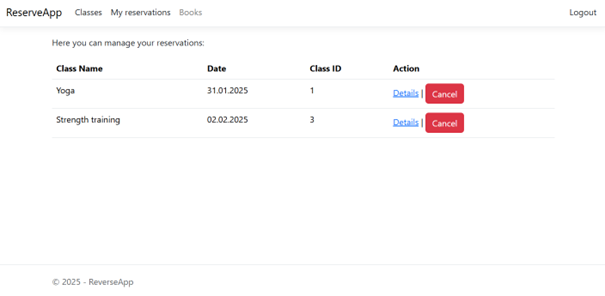
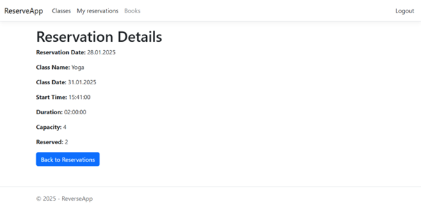
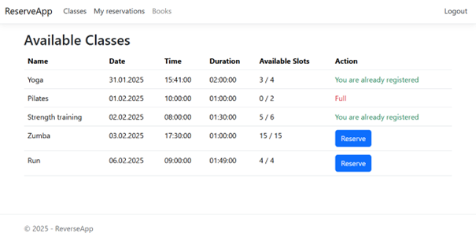
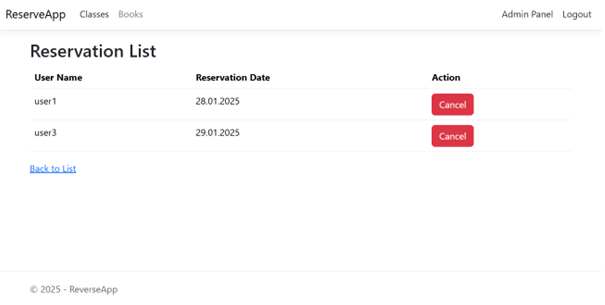

# ReserveApp
## 1.	Wstęp
Projekt jest aplikacją webową, umożliwiającą dokonywanie rezerwacji na zajęcia sportowe przez użytkowników  oraz ich zarządzanie przez administratora. System pozwala użytkownikom na przeglądanie dostępnych zajęć, dokonywanie rezerwacji, a także ich anulowanie. Administrator posiada dodatkowe uprawnienia, które umożliwiają mu zarządzanie zajęciami, wyświetlanie listy użytkowników zapisanych na poszczególne zajęcia oraz anulowanie rezerwacji użytkowników.
## 2.	Specyfikacja zewnętrzna
System posiada różne poziomy dostępu: zwykły użytkownik oraz administrator, który ma dodatkowe uprawnienia.
### Główne funkcjonalności
#### 1.	Rejestracja i logowanie użytkownika
*	Każdy użytkownik może się zarejestrować, podając nazwę użytkownika i hasło.
*	Po zalogowaniu użytkownik ma dostęp do swojego panelu, gdzie widzi swoje rezerwacje.
  

 
*	Przeglądanie szczegółów rezerwacji przez użytkownika

 

#### 2.	Przeglądanie dostępnych zajęć sportowych
*	Na stronie głównej użytkownik widzi listę zajęć sportowych wraz z informacjami o dacie, godzinie, czasie trwania oraz dostępnych miejscach.
*	Jeśli zajęcia nie są pełne, użytkownik może dokonać rezerwacji.

 

#### 3.	Rezerwacja zajęć
*	Użytkownik może zarezerwować zajęcia, jeśli są jeszcze dostępne miejsca.
*	Po zapisaniu się na zajęcia użytkownik nie widzi już przycisku rezerwacji, a zamiast tego pojawia się informacja, że już jest zapisany.
*	Administrator ma możliwość przeglądania listy rezerwacji dla każdej klasy zajęć.

 

#### 4.	Anulowanie rezerwacji
*	Użytkownik może anulować swoją rezerwację, a system automatycznie zwiększy liczbę dostępnych miejsc w bazie danych.
*	Administrator również ma możliwość anulowania rezerwacji innych użytkowników.

#### 5.	Panel administracyjny
*	Administrator może dodawać nowe zajęcia sportowe.
*	Może również przeglądać listy uczestników zajęć oraz anulować rezerwacje.
*	Dla administratora dostępny jest osobny link do Admin Panelu, widoczny w menu nawigacyjnym.

### Interfejs użytkownika
#### Główne menu nawigacyjne dostosowuje się do roli użytkownika:
*	Niezalogowany użytkownik widzi opcje: Login, Register, Classes.
*	Zalogowany użytkownik widzi opcje: Classes, My Reservations, Logout.
*	Administrator dodatkowo widzi: Admin Panel.

## 3. Specyfikacja wewnętrzna
